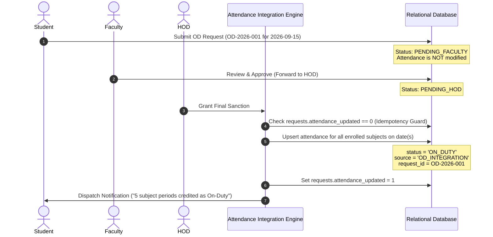

# Automated Student OD and Leave Approval with Attendance Integration

A modern, responsive, full-stack centralized web application designed to automate student On-Duty (OD) and Leave requests, digital multi-tier approvals, real-time attendance calculation, and in-app notifications.

---

## 📌 1. Project Overview & Problem Statement

In conventional college operations, student On-Duty (OD) and Leave tracking is fragmented across paper forms, physical signatures, WhatsApp messages, and disconnected spreadsheets. This causes delays, lost documents, human errors, and critical discrepancies between approved ODs and semester attendance percentages required for exam eligibility.

**This solution provides:**
- **Automated Digital Workflow**: Student submission $\rightarrow$ Faculty recommendation $\rightarrow$ HOD/Admin final sanction.
- **Attendance Integration Engine**: Upon final HOD sanction, class periods on approved dates are automatically credited to the student's attendance records with strict idempotency guards (preventing duplicate credits).
- **In-App Notification Center**: Instant real-time alerts dispatched to students and faculty at every lifecycle event.
- **Role-Based Access Control**: Strict separation of Student, Faculty, and HOD/Admin portals.
- **Analytics & Report Generator**: Department-wise and student-wise reports with instant CSV export.

---

## 🏗️ 2. System Architecture

The project is structured with a **dual architecture** for maximum usability and enterprise readiness:

```
student-od-leave-attendance-system/
│
├── frontend/                             # Modern Responsive Web Client (Bootstrap 5 + Custom Glassmorphism)
│   ├── index.html                        # SPA Container with adaptive role views & modals
│   ├── css/
│   │   └── style.css                     # Custom CSS design system, badges, and progress visualizers
│   └── js/
│       ├── api.js                        # Centralized REST API client with Bearer Auth
│       ├── auth.js                       # Session management & role-based routing
│       ├── student.js                    # Student dashboard, apply OD/Leave, attendance graphs
│       ├── faculty.js                    # Faculty verification queue & review modals
│       ├── admin.js                      # Executive dashboard, final sanctions, CRUD
│       ├── notifications.js              # Real-time notification drawer & badge polling
│       ├── reports.js                    # Live analytics table & CSV export
│       └── app.js                        # Master UI orchestrator
│
├── backend/                              # Runnable REST Backend (Flask + SQLite / MySQL Compatible)
│   ├── app.py                            # Server entry-point, CORS, and blueprint registration
│   ├── database.py                       # Schema initialization, relational tables & demo seed data
│   ├── routes/
│   │   ├── auth_routes.py                # Login, role validation, session endpoints
│   │   ├── student_routes.py             # Student profile, attendance, submit OD/Leave
│   │   ├── faculty_routes.py             # Faculty dashboard & review actions
│   │   ├── admin_routes.py               # HOD sanctions, student/faculty CRUD, reports
│   │   ├── attendance_routes.py          # Attendance direct queries & manual overrides
│   │   └── notification_routes.py        # In-app notifications
│   ├── services/
│   │   ├── approval_service.py           # Multi-tier state machine & validation
│   │   ├── attendance_service.py         # Attendance integration engine (idempotent, single update)
│   │   └── notification_service.py       # Notification dispatcher
│   └── uploads/                          # Supporting document storage
│
├── java-spring-boot-backend/             # Production-Ready Java Spring Boot 3 + MySQL Architecture
│   ├── pom.xml                           # Maven dependencies (Spring Boot 3.2, Data JPA, Security)
│   ├── src/main/java/com/college/odleave/
│   │   ├── OdLeaveApplication.java
│   │   ├── config/                       # SecurityConfig, WebMvcConfig
│   │   ├── controller/                   # AuthController, StudentController, FacultyController, AdminController
│   │   ├── entity/                       # User, Student, Faculty, Subject, Request, Approval, Attendance, Notification
│   │   ├── repository/                   # Spring Data JPA Repositories
│   │   ├── service/                      # RequestService, AttendanceIntegrationService, NotificationService
│   │   └── dto/                          # Request and response DTOs
│   └── src/main/resources/
│       └── application.properties        # MySQL and JPA configuration
│
├── database/
│   ├── schema.sql                        # Production MySQL DDL schema with PKs, FKs, unique constraints & indexes
│   └── seed_data.sql                     # SQL seed dataset (10 students, 3 faculty, 1 HOD, 5 subjects, attendance)
│
├── tests/
│   ├── test_od_leave_system.py           # Comprehensive automated functional integration tests
│   └── validate_assets_and_flows.py      # Asset resolution & live HTTP tests
│
├── run.py                                # One-click runner script
└── requirements.txt                      # Python dependencies
```

---

## ⚡ 3. Quick Start & Execution

### Prerequisites
- Python 3.10+ (Pre-installed with standard libraries).

### Step 1: Install Dependencies (Optional if Flask already installed)
```bash
pip install -r requirements.txt
```

### Step 2: Start the Web Application
```bash
python run.py
```

Open your browser and navigate to:
👉 **`http://127.0.0.1:5000`**

---
### 🔐 Demo Login

The system uses role-based authentication for Student, Faculty, and HOD users.

For security reasons, login credentials are not published in this repository.

### User Roles

- **Student** – Apply for OD/Leave and track request status
- **Faculty** – Review and approve/reject student requests
- **HOD** – Perform final approval/rejection
- **Admin** – Manage the system and users

## ⚙️ 5. Key Modules & Functional Workflows

### 🎓 1. Student Module
- **Live Attendance Dashboard**: Real-time overall percentage calculated with dynamic color indicators:
  - 🟢 **Good ($\ge$ 75%)**
  - 🟡 **Warning (65% - 74%)**
  - 🔴 **Critical Defaulter (< 65%)**
- **Apply for On-Duty (OD)**:
  - Input event name, event type, date range, venue, reason, upload supporting document (PDF/JPG/PNG), and optional remarks.
  - Generates unique code (e.g. `OD-2026-004`), sets status to `PENDING_FACULTY`, and alerts assigned mentor.
- **Apply for Leave**:
  - Medical, Personal, Sick, Emergency, or Family Leave with date selection and reason.
- **My Requests & Timeline**:
  - Filterable table with live status badges.
  - Interactive approval timeline stepper with timestamps and faculty/HOD remarks.
- **Subject-wise Attendance & OD Credit Breakdown**:
  - Displays Total Conducted, Attended, Approved ODs, Absent, and Effective Percentage per subject.

### 👨‍🏫 2. Faculty Module
- **Faculty Dashboard**: Mentored student count, pending OD count, pending Leave count, approved and rejected metrics.
- **Pending Verification Queue**: Lists student requests under the faculty with current attendance percentage snapshot.
- **Review & Verification**:
  - Inspect student participation details and uploaded certificate/invitation.
  - **Approve & Forward**: Adds remarks, transitions status to `PENDING_HOD`, and forwards to HOD.
  - **Reject with Mandatory Remarks**: Rejects request, halts workflow, and dispatches notification to the student.

### 🏛️ 3. HOD / Admin Module
- **Executive Dashboard**: Aggregate analytics, total faculty/students/subjects, average department attendance.
- **Request Management**: Multi-filter bar by Department, Year, Section, Request Type, and Status with live search.
- **Final Sanction & Attendance Integration**:
  - One-click final approval triggers the **Attendance Integration Engine**.
- **Student & Faculty Directory (CRUD)**: Add, edit, and manage students and faculty.
- **Analytics & Report Generation**: Generate custom reports and export to **CSV**.

---

## 🔄 6. How Attendance Integration Works



### Mathematical Formula
$$\text{Effective Present} = \text{Regular Attended Classes} + \text{Approved OD Classes}$$
$$\text{Effective Attendance \%} = \frac{\text{Effective Present}}{\text{Total Classes Conducted}} \times 100$$

### Idempotency & Safety Rules
1. Zero attendance modification while request is in `PENDING_FACULTY` or `PENDING_HOD`.
2. Attendance is updated only after final HOD approval.
3. Database `UNIQUE(student_id, subject_id, attendance_date)` constraint and `attendance_updated = 1` flag prevent duplicate credits.
4. Rejected requests never modify attendance.

---

## 📡 7. REST API Endpoints

### Authentication
- `POST /api/auth/login` - Authenticate with credentials and role
- `GET /api/auth/me` - Get current session profile
- `POST /api/auth/forgot-password` - Password recovery assistance

### Students & Requests
- `GET /api/students/{id}/attendance` - Get subject-wise & overall attendance metrics
- `GET /api/students/{id}/history` - Get daily attendance audit logs
- `POST /api/requests` - Submit OD or Leave request with document upload
- `GET /api/requests/my` - Get authenticated student's submissions
- `GET /api/requests/{id}` - Get full request details and approval audit timeline

### Faculty
- `GET /api/faculty/dashboard` - Faculty KPI metrics
- `GET /api/faculty/requests/pending` - Assigned pending verification queue
- `PUT /api/faculty/requests/{id}/approve` - Approve & forward to HOD
- `PUT /api/faculty/requests/{id}/reject` - Reject with mandatory remarks

### HOD / Admin
- `GET /api/admin/dashboard` - Executive dashboard statistics
- `GET /api/admin/requests` - Multi-criteria filterable request list
- `PUT /api/admin/requests/{id}/approve` - Sanction request & execute attendance integration
- `PUT /api/admin/requests/{id}/reject` - Reject request
- `GET /api/admin/students` | `POST` | `PUT` | `DELETE` - Student CRUD
- `GET /api/admin/faculty` | `POST` | `PUT` | `DELETE` - Faculty CRUD
- `GET /api/admin/reports` - Generate reports and export CSV (`?export=true`)

### Notifications
- `GET /api/notifications` - Get user notifications
- `GET /api/notifications/unread-count` - Badge counter
- `PUT /api/notifications/{id}/read` - Mark single notification as read
- `PUT /api/notifications/read-all` - Mark all as read

---

## 🧪 8. Automated Testing & Verification

Run the test suite:
```bash
python -m unittest tests/test_od_leave_system.py
```

### Test Coverage Results:
- `test_01_auth_login_student`: ✅ Passed
- `test_02_auth_invalid_credentials`: ✅ Passed
- `test_03_auth_role_mismatch`: ✅ Passed
- `test_04_student_attendance_calculation`: ✅ Passed
- `test_05_student_submit_od_request_and_duplicate_guard`: ✅ Passed
- `test_06_complete_approval_and_attendance_integration_workflow`: ✅ Passed
- `test_07_faculty_rejection_halts_workflow`: ✅ Passed
- `test_08_admin_student_crud_and_reports`: ✅ Passed
